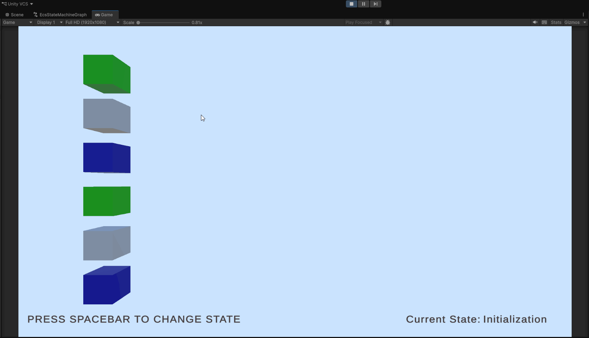
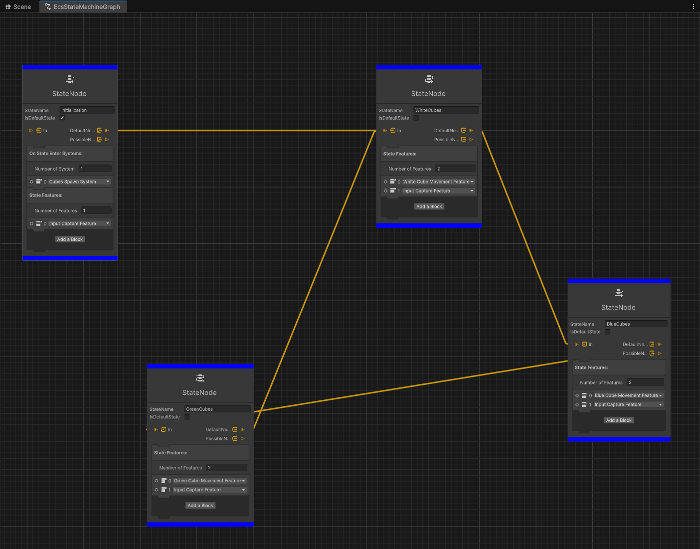
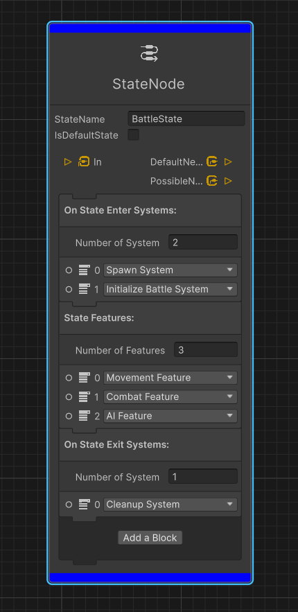

# ECS State Machine

Visual state management system for Unity ECS projects built on **LeoEcsLite**.

Create gameplay states using Unity Graph Toolkit, organize systems into reusable features, and control ECS execution flow through a state-driven architecture.

## Demo

Demo show how state transitions and executing systems can be changed on the fly. 



## Overview

ECS State Machine provides a visual workflow for managing complex gameplay states in Unity.

The system allows you to:

- create states and transitions using Unity Graph Toolkit;
- assign ECS features to states;
- configure systems executed on state enter and exit;
- generate required identifiers and factories automatically;
- convert graph data into optimized runtime representation.

## Graph Editor

Graph example:

Node example:<br>


Each state node represents an ECS state and can contain:

- Features
- On State Enter systems
- On State Exit systems
- State transitions

Example:

```text
Battle State

On Enter:
    SpawnSystem
    InitializeBattleSystem

Features:
    MovementFeature
    CombatFeature
    AIFeature

On Exit:
    CleanupSystem
```

## Core Concepts

### State

A state represents a gameplay state in ECS.

Examples:

- Main Menu
- Battle
- Shop
- Reward Screen
- Loading

Each state can define:

- systems executed when entering;
- systems executed when leaving;
- active feature groups;
- possible transitions.

---

### Feature

A feature is a group of ECS systems activated together when a state becomes active.

Example:

```csharp
public sealed class CombatFeature : EcsFeature
{
    public override IEcsSystem[] GetSystems()
    {
        return new IEcsSystem[]
        {
            new AttackSystem(),
            new DamageSystem(),
            new DeathSystem()
        };
    }
}
```

A feature groups related gameplay logic:

```text
CombatFeature

    AttackSystem
    DamageSystem
    DeathSystem
```

Features are enabled and disabled automatically during state changes.

---

### State Change Systems

State change systems are executed only during transitions.

There are two types:

#### Enter Systems

Executed when entering a state.

Example:

```text
Battle State Enter

SpawnEnemiesSystem
InitializeBattleSystem
```

#### Exit Systems

Executed before leaving a state.

Example:

```text
Battle State Exit

SaveResultSystem
CleanupBattleSystem
```

Implementation:

```csharp
public sealed class PrepareBattleSystem : IEcsStateChangeSystem
{
    public void Run()
    {
        // State initialization logic
    }
}
```

## Runtime Flow

### Initialization

When the state machine starts:

```text
1. Load Runtime Graph

2. Create ECS system groups

3. Read states from graph

4. Add state change systems

5. Create feature groups

6. Inject dependencies

7. Initialize ECS systems

8. Start ECS loop
```

### State Transition

State change flow:

```text
Old State
    v
Disable old Features
    v
Run Exit Systems
    v
Wait one frame
    v
Run Enter Systems
    v
Enable new Features
    v
New State
```

## Code Generation

The system automatically generates:

### State IDs

```text
EcsStatesIds
```

Example:

```csharp
public enum EcsStatesIds
{
    None,

    Menu = 123456,
    Battle = 789123
}
```
Used for setting certain states from game code. 

### Feature IDs
After creating new Feature code will be regenerated and Feature will become available in the graph editor. 

```text
EcsFeatureIds
```

Used for selecting features inside graph nodes.

### State Change System IDs
After creating new IEcsStateChangeSystem code will be regenerated and Feature will become available in the graph editor. 

```text
EcsStateChangeSystemsIds
```

Used for selecting enter and exit systems inside graph nodes.

### Factories

Generated automatically:

```text
EcsFeatureFactory

EcsStateChangeSystemsFactory
```

Factories create ECS objects from generated identifiers.

## Stable IDs

Runtime references are not based on enum indexes.

Instead, identifiers are generated from type or state names:

```text
Name
 v
Stable Hash
 v
Integer ID
```

This provides:

- persistent references;
- safe graph serialization;
- no dependency on enum order.

## Runtime Data

Runtime graph stores references using generated IDs instead of direct object references.

Example:

```csharp
public int DefaultNextState;

public List<int> PossibleNextStates;
```

This avoids Unity serialization depth limitations and allows cyclic graphs:

```text
State A
  v
State B
  v
State A
```

## Creating Custom Feature

Create a class derived from `EcsFeature`:

```csharp
public sealed class MovementFeature : EcsFeature
{
    public override IEcsSystem[] GetSystems()
    {
        return new IEcsSystem[]
        {
            new MovementSystem(),
            new RotationSystem()
        };
    }
}
```

After code generation the feature becomes available in the graph editor.

## Creating State Change System

Implement:

```csharp
public sealed class EnterBattleSystem : IEcsStateChangeSystem
{
    public void Run()
    {
        // Execute logic on state change
    }
}
```

The system becomes available after regeneration.

## Design Decisions

### Why use dictionaries instead of references?

Unity has serialization depth limitations.

Runtime graph uses:

```csharp
Dictionary<int, RuntimeStateNode>
```

This allows storing cyclic graphs safely.

### Why Features?

Features separate gameplay modules from states.

Instead of:

```text
Battle State

50 systems
```

the state contains:

```text
Battle State

Combat Feature
Movement Feature
AI Feature
```

This improves scalability and readability.

### Why separate State Change Systems?

State transitions are different from regular ECS update logic.

They execute only once during transitions instead of every frame.

## Requirements

- Unity 6.5+
- LeoEcsLite
- LeoEcsLite.ExtendedSystems
- LeoEcsLite.Di
- Unity Graph Toolkit
- Odin Inspector
- UniTask

## License

MIT License